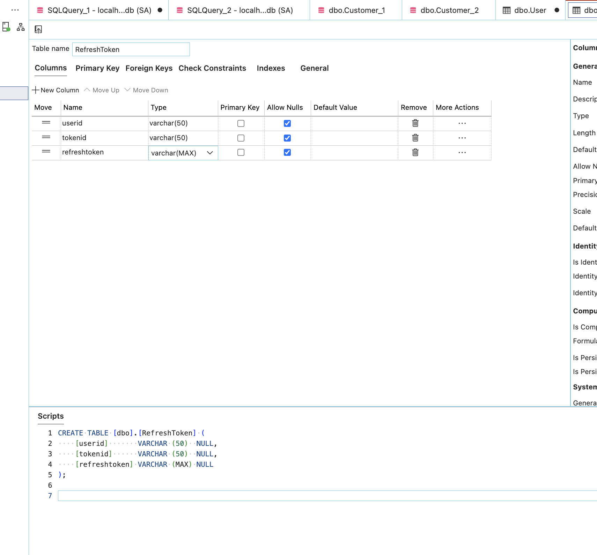
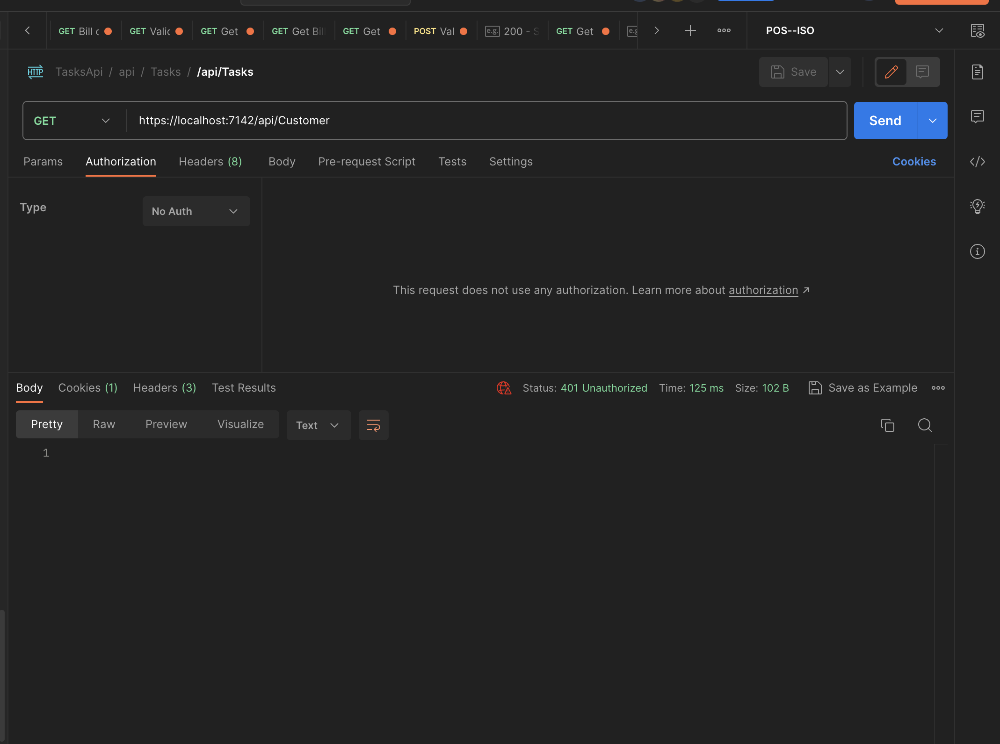
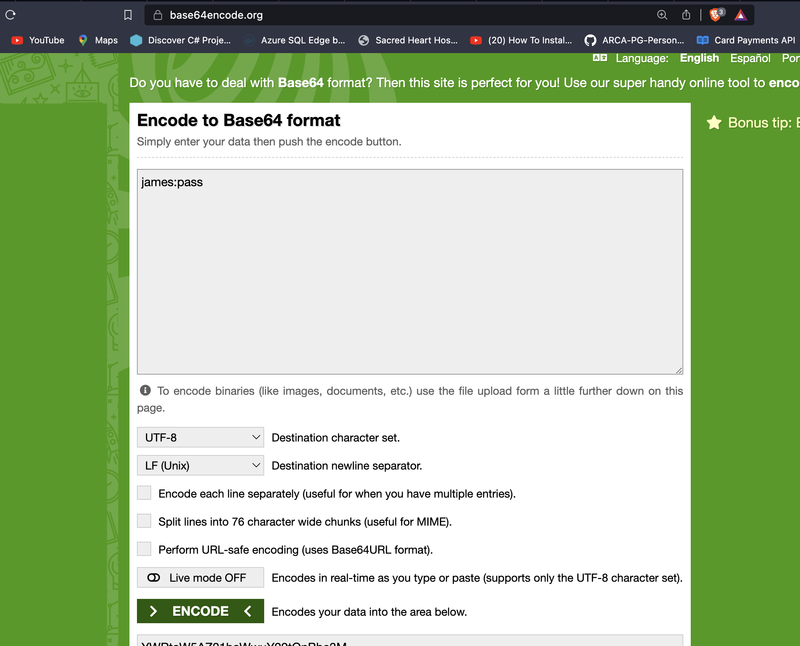
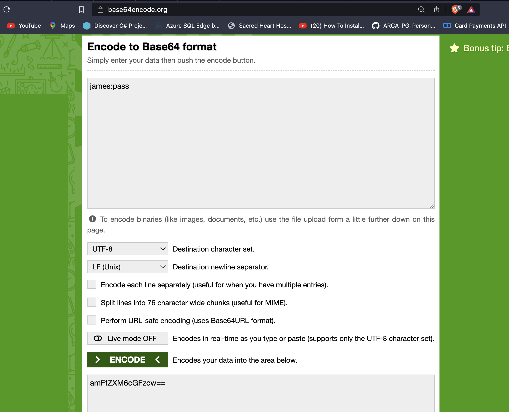
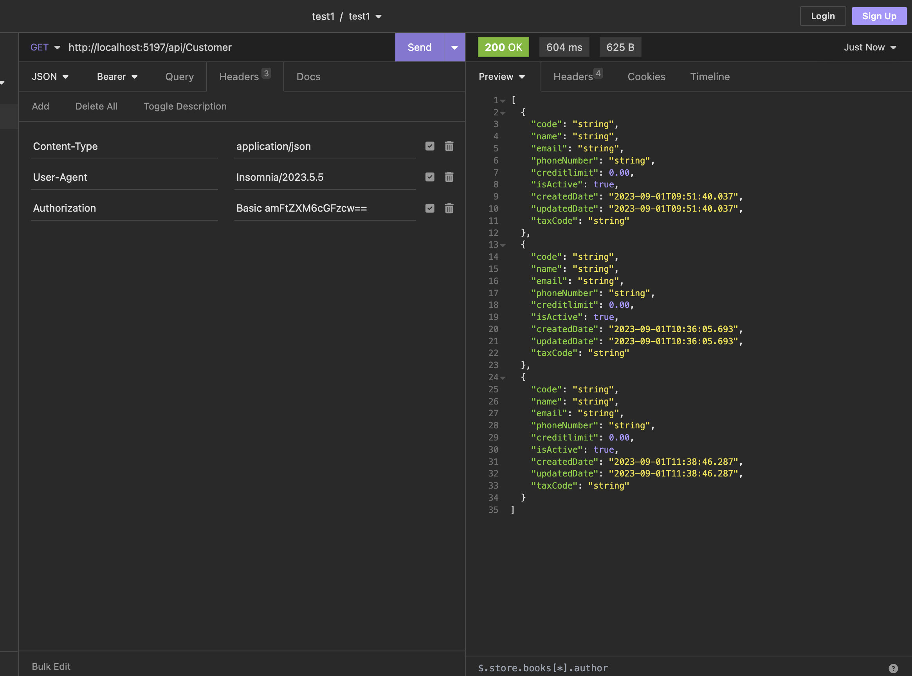

##### EF, AutoMapper, Logging with Serilog, RateLimting, Cors, Basic Authenticartion

##### Entity framework

- Database First approach
- Code First approach
- Model First Approach

force drop db

```sql
USE master;
ALTER DATABASE schooldb SET SINGLE_USER WITH ROLLBACK IMMEDIATE;
DROP DATABASE schooldb;

```

Ef Scaffold command

```
Scaffold-DbContext "Server=.;Database=schooldb;Trusted_Connection=True;" Microsoft.EntityFrameworkCore.SqlServer -OutputDir Models
```

Ef Scaffold command with the force option

```
Scaffold-DbContext "Server=.;Database=schooldb;Trusted_Connection=True;" Microsoft.EntityFrameworkCore.SqlServer -OutputDir Models -Force
```

using the dotnet cli

```
dotnet ef dbcontext scaffold "Server=localhost,1433;Database=schooldb;User Id=SA;Password=Bassguitar1;Encrypt=false;TrustServerCertificate=True;" Microsoft.EntityFrameworkCore.SqlServer -o Repos/Models --context LearnDataContext --context-dir Repos --data-annotations
```

using the dotnet cli with the force option

```
dotnet ef dbcontext scaffold "Server=localhost,1433;Database=schooldb;User Id=SA;Password=Bassguitar1;Encrypt=false;TrustServerCertificate=True;" Microsoft.EntityFrameworkCore.SqlServer -o Repos/Models --context LearnDataContext --context-dir Repos --data-annotations --force
```

After migration remove this line


##### Install Ef

dotnet add package Microsoft.EntityFrameworkCore
dotnet add package Microsoft.EntityFrameworkCore.SqlServer
dotnet add package Microsoft.EntityFrameworkCore.Tools
dotnet add package Microsoft.EntityFrameworkCore.Design

To Scafold, you need to create the table first in the database

```sql
CREATE Database schooldb;

USE SchoolDB;
-- Customer Table
-- Code , Name, Email, PhoneNumber, Creditlimit, IsActive, CreatedDate, UpdatedDate, TaxCode
CREATE TABLE Customer(
    Id INT IDENTITY(1,1) PRIMARY KEY,
    Code VARCHAR(50) NOT NULL,
    Name VARCHAR(50) NOT NULL,
    Email VARCHAR(50) NOT NULL,
    PhoneNumber VARCHAR(50) NOT NULL,
    Creditlimit DECIMAL(18,2) NOT NULL,
    IsActive BIT NOT NULL,
    CreatedDate DATETIME NOT NULL,
    UpdatedDate DATETIME NOT NULL,
    TaxCode VARCHAR(50) NOT NULL
);

-- User Table
-- Code , Name, Email, PhoneNumber, IsActive, CreatedDate, UpdatedDate, Password
CREATE TABLE [User](
    Id INT IDENTITY(1,1) PRIMARY KEY,
    Code VARCHAR(50) NOT NULL,
    Name VARCHAR(50) NOT NULL,
    Email VARCHAR(50) NOT NULL,
    PhoneNumber VARCHAR(50) NOT NULL,
    IsActive BIT NOT NULL,
    CreatedDate DATETIME NOT NULL,
    UpdatedDate DATETIME NOT NULL,
    Password VARCHAR(50) NOT NULL
);
```

---

##### Logging

dotnet add package Serilog.AspNetCore
dotnet add package Serilog.Sinks.File



---

##### Add basic Authentication

```sql

using System.Net.Http.Headers;
using System.Security.Claims;
using System.Text;
using System.Text.Encodings.Web;
using Microsoft.AspNetCore.Authentication;
using Microsoft.Extensions.Options;
using Techie.Repos;

namespace Techie.Helper
{
    public class BasicAuthenticationHandler : AuthenticationHandler<AuthenticationSchemeOptions>
    {
        private readonly LearnDataContext _context;
        public BasicAuthenticationHandler(
            IOptionsMonitor<AuthenticationSchemeOptions> options, ILoggerFactory logger, UrlEncoder encoder,
            ISystemClock clock, LearnDataContext context) : base(options, logger, encoder, clock)
        {
            _context = context;
        }

        protected async override Task<AuthenticateResult> HandleAuthenticateAsync()
        {
            if (!Request.Headers.ContainsKey("Authorization"))
            {
                return AuthenticateResult.Fail("No header found");
            }

            var headervalue = AuthenticationHeaderValue.Parse(Request.Headers["Authorization"]);
            if (headervalue != null)
            {
                var bytes = Convert.FromBase64String(headervalue.Parameter);
                string credentials = Encoding.UTF8.GetString(bytes);
                string[] array = credentials.Split(":");
                string username = array[0];
                string password = array[0];
                var user = _context.Users.FirstOrDefault(x => x.Email == username && x.Password == password);
                if (user != null)
                {
                    var claims = new[] {
                        new Claim(ClaimTypes.NameIdentifier, user.Id.ToString()),
                        new Claim(ClaimTypes.Name, user.Email)
                    };
                    var identity = new ClaimsIdentity(claims, Scheme.Name);
                    var principal = new ClaimsPrincipal(identity);
                    var ticket = new AuthenticationTicket(principal, Scheme.Name);
                    return AuthenticateResult.Success(ticket);
                }

                return AuthenticateResult.Fail("Invalid username or password");

            }
            else
            {
                return AuthenticateResult.Fail("Invalid header");


            }
        }
    }
}
```

// In program.cs

```csharp
builder.Services.AddAuthentication("BasicAuthentication").AddScheme<AuthenticationSchemeOptions, BasicAuthenticationHandler>("BasicAuthentication", null);

app.UseCors("CorsPolicy");

app.UseHttpsRedirection();

app.UseAuthentication();

app.UseAuthorization();

app.MapControllers();

app.Run();

```

In the Controller

```csharp

namespace Techie.Container
{

    [Authorize]
    [EnableRateLimiting("fixed window")]
    // [EnableCors("CorsPolicy")]
    [Route("api/[controller]")]
    public class CustomerController : ControllerBase
    {
        private readonly ICustomerService _service;
        public CustomerController(ICustomerService service)
        {
            _service = service;
        }

        // [DisableCors]
        [HttpGet]
        public async Task<IActionResult> GetAll()
        {
            var data = await _service.GetAll();
            if (data == null)
                return NotFound();
            return Ok(data);
        }

        [HttpPost]
        public async Task<IActionResult> AddCustomer([FromBody] CustomerModel customer)
        {
             await _service.AddCustomer(customer);
            return Ok("Added successfully");
        }
```



To use the Basic Authentication
Use the base64e encoder : https://www.base64encode.org/

Copy the encoded string and add it to the header



---

##### Remove the Basic Authentication

```csharp

using Microsoft.AspNetCore.Authorization;
using Microsoft.AspNetCore.Mvc;
using Microsoft.AspNetCore.RateLimiting;
using Techie.Modal;
using Techie.Service;

// For more information on enabling Web API for empty projects, visit https://go.microsoft.com/fwlink/?LinkID=397860

namespace Techie.Container
{

    [Authorize]
    [EnableRateLimiting("fixed window")]
    // [EnableCors("CorsPolicy")]
    [Route("api/[controller]")]
    public class CustomerController : ControllerBase
    {
        private readonly ICustomerService _service;
        public CustomerController(ICustomerService service)
        {
            _service = service;
        }

        // [DisableCors]
        [HttpGet]
        public async Task<IActionResult> GetAll()
        {
            var data = await _service.GetAll();
            if (data == null)
                return NotFound();
            return Ok(data);
        }

        [HttpPost]
        public async Task<IActionResult> AddCustomer([FromBody] CustomerModel customer)
        {
             await _service.AddCustomer(customer);
            return Ok("Added successfully");
        }

        [AllowAnonymous] // This will allow the method to be accessed without authentication
        [DisableRateLimiting]
        [HttpGet("{id}")]
        public async Task<IActionResult> GetById(int id)
        {
            var data = await _service.GetById(id);
            if (data == null)
                return NotFound("No data found");
            return Ok(data);
        }

        [HttpDelete("{id}")]
        public async Task<IActionResult> RemoveById(int id)
        {
            var data = await _service.RemoveById(id);
            if (data == null)
                return NotFound();
            return Ok(data);
        }

        [HttpPut("{id}")]
        public async Task<IActionResult> Update([FromBody] CustomerModel customer, int id)
        {
            var data = await _service.Update(customer, id);
            if (data == null)
                return NotFound();
            return Ok(data);
        }

    }
}

```


---

##### For JWT Authentication install the following packages
- dotnet add package Microsoft.AspNetCore.Authentication.JwtBearer


###### Install Bcrypt for password hashing
- dotnet add package BCrypt.Net-Next


---

##### Upload file into the server
```csharp

using Microsoft.AspNetCore.Mvc;
using Techie.Modal;

namespace Techie.Controllers
{
    [ApiController]
    [Route("api/[controller]")]
    public class ProductController : ControllerBase
    {
        private readonly IWebHostEnvironment _env; // IWebHostEnvironment is used to get the path of the wwwroot folder
        // the wwwroot folder is used to store the images in the project
        public ProductController(IWebHostEnvironment env)
        {
            _env = env;
        }

        [HttpPut("UploadImage")]
        public async Task<IActionResult> UploadImage(IFormFile file, string productcode)
        {
            ApiResponse response = new ApiResponse();
            try
            {
                if (file == null || file.Length == 0)
                {
                    response.ResponseCode = 400; // Bad Request
                    response.ErrorMessage = "No file uploaded.";
                    return BadRequest(response);
                }

                string FilePath = GetFilePath(productcode);
                if (!Directory.Exists(Path.GetDirectoryName(FilePath)))
                {
                    Directory.CreateDirectory(Path.GetDirectoryName(FilePath));
                }

                using (var stream = new FileStream(FilePath, FileMode.Create))
                {
                    await file.CopyToAsync(stream);
                }

                // Ensure the saved file has a .png extension
                string extension = Path.GetExtension(FilePath);
                if (string.IsNullOrEmpty(extension) || !extension.Equals(".png", StringComparison.OrdinalIgnoreCase))
                {
                    // Rename the file with a .png extension
                    string newFilePath = Path.ChangeExtension(FilePath, ".png");
                    System.IO.File.Move(FilePath, newFilePath);
                    FilePath = newFilePath;
                }

                response.ResponseCode = 200;
                response.Result = "Image uploaded successfully";
            }
            catch (Exception ex)
            {
                response.ResponseCode = 500; // Internal Server Error
                response.ErrorMessage = ex.Message;
            }

            return Ok(response);
        }

        [NonAction] // This method will not be exposed to the client, it is the same as [ApiExplorerSettings(IgnoreApi = true)]
        private string GetFilePath(string productcode)
        {
            // Ensure the file has a .png extension
            if (!productcode.EndsWith(".png", StringComparison.OrdinalIgnoreCase))
            {
                productcode = Path.ChangeExtension(productcode, ".png");
            }

            string FilePath = Path.Combine(_env.WebRootPath, "Upload", "product", productcode);
            return FilePath;
        }

    }
}
```


Method 2
```csharp

using Microsoft.AspNetCore.Mvc;
using Techie.Modal;

namespace Techie.Controllers
{
    [ApiController]
    [Route("api/[controller]")]
    public class ProductController : ControllerBase
    {
        private readonly IWebHostEnvironment _env; // IWebHostEnvironment is used to get the path of the wwwroot folder
        // the wwwroot folder is used to store the images in the project
        public ProductController(IWebHostEnvironment env)
        {
            _env = env;
        }

        [HttpPut("UploadImage")]
        public async Task<IActionResult> UploadImage(IFormFile formFile, string productcode){
            ApiResponse response = new ApiResponse();
            try
            {
                // string filePath   = Path.Combine(_env.WebRootPath, "Upload", "product", formFile.FileName);
                string filePath   = GetFilePath(productcode);
                if(!Directory.Exists(filePath)){
                    Directory.CreateDirectory(filePath);
                }
                string imagePath = filePath + "/" + productcode + ".png";
                // check if the file exists
                if(System.IO.File.Exists(imagePath)){
                    System.IO.File.Delete(imagePath);
                }
                // save and store the image
                using(var stream = new FileStream(imagePath, FileMode.Create)){
                    await formFile.CopyToAsync(stream);
                    response.Result = "Image Uploaded Successfully";
                    response.ResponseCode = 200;
                }
            }
            catch (Exception ex)
            {
                response.ErrorMessage = ex.Message;
            }
            return Ok(response);
        }

         [HttpPut("MultipleUploadImage")]
        public async Task<IActionResult> MultipleUploadImage(IFormFileCollection fileCollection, string productcode){
            ApiResponse response = new ApiResponse();
            int passcount = 0; int errorcount = 0;
            try
            {
                // string filePath   = Path.Combine(_env.WebRootPath, "Upload", "product", formFile.FileName);
                string filePath   = GetFilePath(productcode);
                if(!Directory.Exists(filePath)){
                    Directory.CreateDirectory(filePath);
                }
              
                foreach (var file in fileCollection)
                {
                      string imagePath = filePath + "/" + file.FileName;
                // check if the file exists
                if(System.IO.File.Exists(imagePath)){
                    System.IO.File.Delete(imagePath);
                }
                  // save and store the image
                using(var stream = new FileStream(imagePath, FileMode.Create)){
                    await file.CopyToAsync(stream);
                    passcount++;
                }
                }
              
            }
            catch (Exception ex)
            {
                errorcount++;
                response.ErrorMessage = ex.Message;
            }
            response.Result = $"{passcount} Image(s) Uploaded Successfully and {errorcount} Image(s) Failed";
            return Ok(response);
        }

        [NonAction] // this is same as [ApiExplorerSettings(IgnoreApi = true)]
        private string GetFilePath(string productcode){
            return Path.Combine(_env.WebRootPath, "Upload", "product", productcode);
        }

    }
}
```